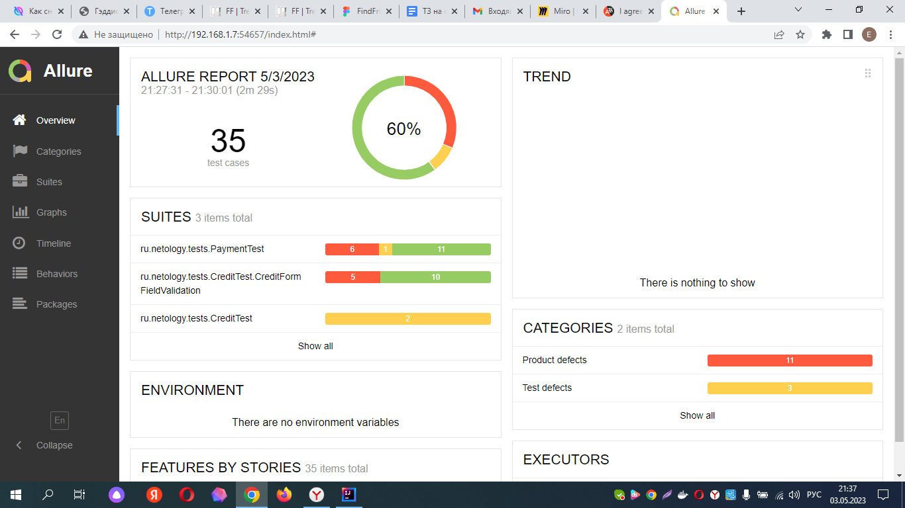

## Отчет о проведенном тестировании
### Краткое описание
Было проведено тестирование комплексного сервиса, взаимодействующего с СУБД и API Банка.
Приложение представляет собой веб-сервис, который предоставляет возможность купить тур по определённой цене с помощью двух способов:

Обычная оплата по дебетовой карте
Уникальная технология: выдача кредита по данным банковской карты

На начальном этапе было проведено исследовательское (ручное) тестирование для ознакомления с проектом.
На следующем этапе были созданы авто-тесты.

Тестирование было проведено для двух баз данных - MySQL и PostgreSQL.
### Количество тест-кейсов и % успешных/не успешных
Количество тест-кейсов - 35, % успешных/не успешных варьируется от 60/40

  

## Общие рекомендации
Разработать спецификацию, либо другим способом оформить требования для данного приложения
Исправить выявленные ошибки